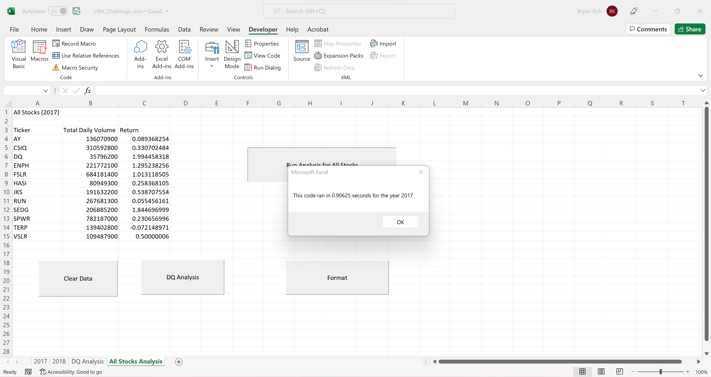
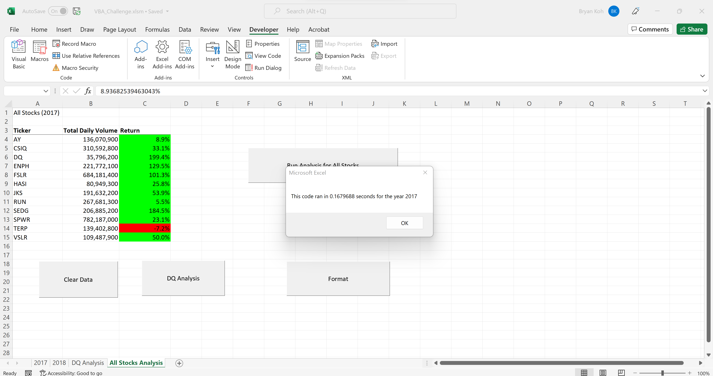
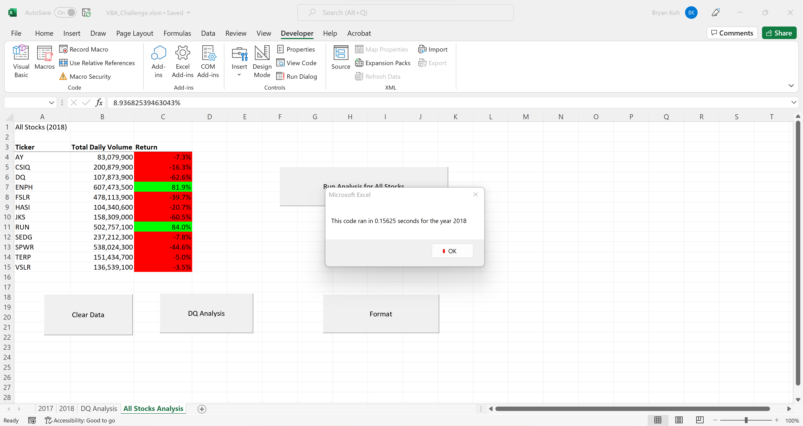

# Stock Analysis using VBA

###Overview of Project

-Using Excel's VBA function, I analyzed data from 2017 and 2018 stocks for 12 tickers (AY, CSIQ, DQ, ENPH, FSLR, HASI, JKS, RUN , SDG, SPWR, TERP, VSLR)

-Identified trends in Total Daily Volume and Return rates for both 2017 and 2018

-Implemented a code to identify and output the specific Ticker, Total Daily Volume and Return rate by inputting a specific year

-Increased efficiency to run the program for any year given new data and increased run time for the program

###Results
-From the first code that I implemented (can be viewed in green_stocks.xlsm or using the buttons on VBA_Challenge.xlsm)

-It can be seen from the image above that the process for the first code created that used variables that matched the specific document ran in 0.90625 seconds for the data in the 2017 stocks

-Compared to the first code, the Regactored code ran in about 0.1679688 seconds and 0.15626 seconds for 2017 and 2018 stocks, respectively.

###Summary
-The advantages of refactoring code is that, if given a new sheet of data for 2019 with the same tickers, the refactored code would be able to analyze the data in the same way as long as the data matches the same format as the previous data.

-The other obvious advantage is that refactoring code shaves off run time by a lot, in the long run this is beneficial for a program that is much larger.

-The disadvantage is that it could get long and complicated, be sure to make lots of comments so that others can easily view your code and get into your mindset.

-When refactoring the VBA script, I found myself getting stuck and debugging more. But in the end, the code ran faster and became more versatile. 